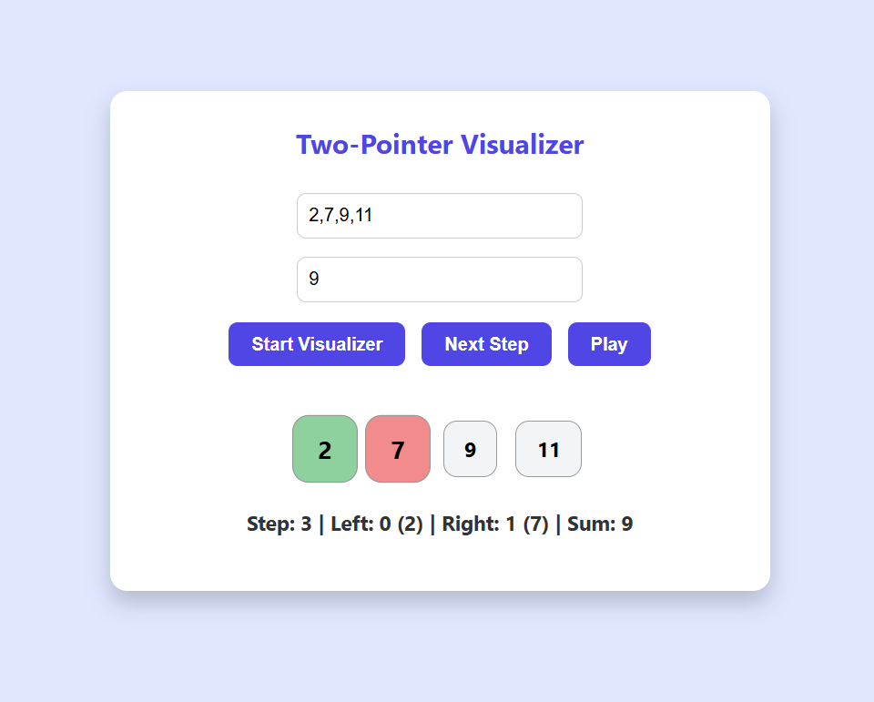

2-Pointer Visualizer

A simple web-based visualizer to understand the two-pointer technique commonly used in array problems. This tool allows you to step through or automatically play the process of finding two numbers that sum to a target.

Features

Input an array of numbers and a target value.

Step through each iteration of the two-pointer algorithm.

Automatically play the steps with adjustable speed.

Highlights:

Left pointer in green

Right pointer in red

Both pointers meeting in purple

Displays step number, pointer positions, and sum at each step.

Demo

Enter an array: 2,7,11,15

Enter a target: 9

Click Start Visualizer to initialize.

Use Next Step to go manually or Play to animate automatically.

Pointers are color-coded and highlighted with animation.

How to Use

Clone the repository:

git clone https://github.com/Krishika-25/Dsa-tools.git

Open 2-pointer-visualizer/index.html in your browser.

Enter your array and target values.

Use the buttons to control the visualization.

Technologies Used

HTML, CSS, JavaScript

DOM Manipulation for dynamic visualization

Simple interval-based animation

Folder Structure
2-pointer-visualizer/
├── index.html      # Main HTML file
├── style.css       # Styles for visualization
└── script.js       # JavaScript logic for 2-pointer visualization
How It Works

The algorithm initializes two pointers: l = 0 (left) and r = array.length - 1 (right).

At each step:

Calculate sum = nums[l] + nums[r].

If sum === target, stop and show success.

If sum < target, move left pointer right.

If sum > target, move right pointer left.

Visualization updates each step with colors and pointer positions.